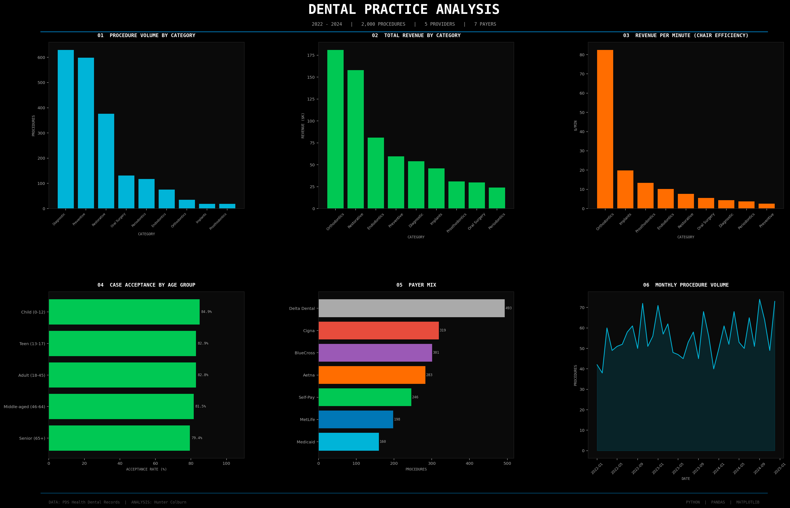
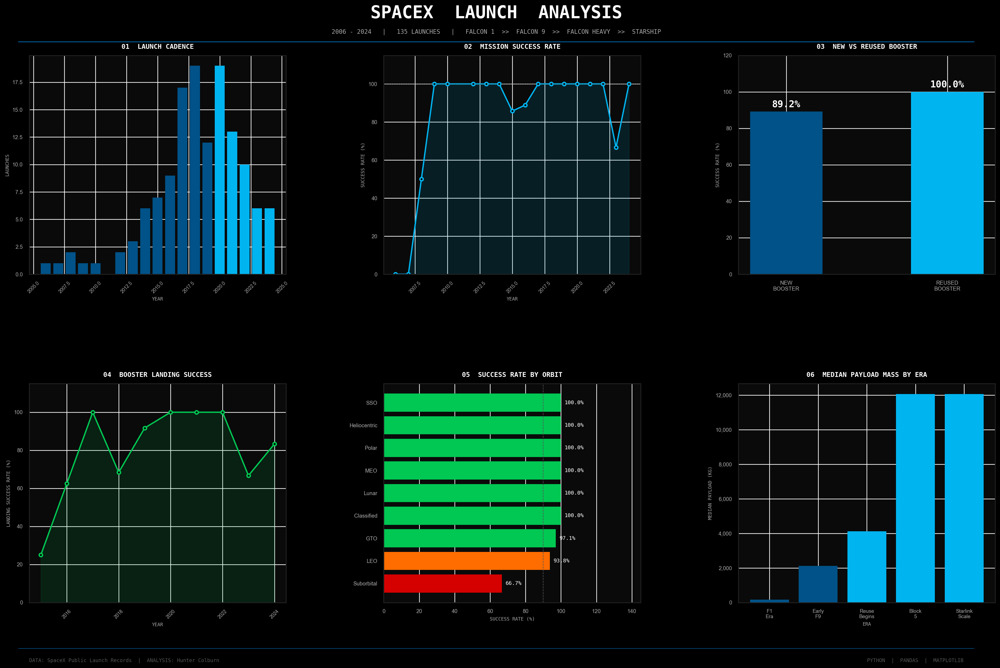
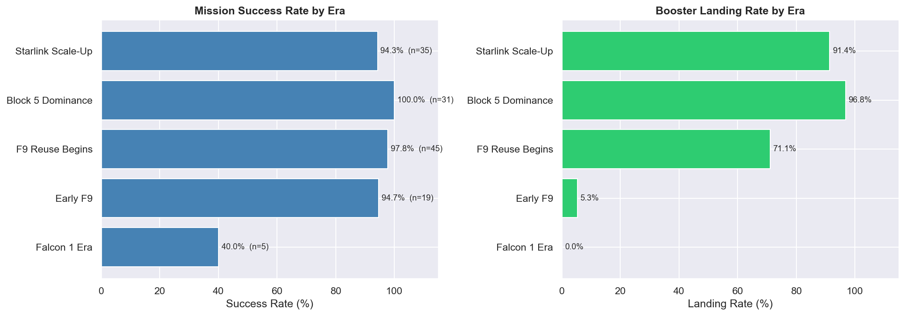

# Analysis Notebooks

Data analysis portfolio — Python, pandas, matplotlib, seaborn, Jupyter.

Two self-contained studies, each with its data, notebook, and rendered output.

---

## 🦷 Dental Practice Analysis

**[Notebook](dental-analysis/notebooks/dental_analysis.ipynb)** · 2,000 procedures · 2022–2024

> **Data note:** this is an older, publicly available study dataset found online - not records obtained from any dental practice. It contains no patient identifiers (ages are bracketed, providers are generic surnames). The "PDS Health" label in the dashboard footer reflects the dataset's original title, not a data source relationship.

Starts from raw procedure records and works through a set of practice-management questions:

- Which procedure categories drive **volume** vs **revenue**? (Orthodontics leads revenue at ~$181K despite low volume)
- Are high-revenue procedures actually **efficient** once chair time is accounted for? (revenue per minute by category)
- Is there **seasonality** in dental work? (month × category heatmap)
- Which **age groups** book most, and which actually **accept treatment**? (seniors show the lowest acceptance rate at 79.4%)

Everything rolls up into a six-panel dashboard:



## 🚀 SpaceX Launch Analysis

**[Notebooks](spacex-launch-analysis/notebooks/)** · historical launch records

A progressive analysis of SpaceX launch data — loading and exploring the raw records, building visualizations, cleaning and feature engineering, then a deep dive into launch outcomes across eras. The `*_executed.ipynb` files contain the run outputs.





---

## Structure

```
dental-analysis/
├── data/         raw CSV
├── notebooks/    analysis notebook
└── outputs/      rendered dashboard

spacex-launch-analysis/
├── data/         raw + cleaned CSVs
├── notebooks/    analysis notebooks (+ executed copies)
└── outputs/      rendered dashboards
```

## Tools

Python · pandas · matplotlib · seaborn · Jupyter

Datasets are public/study data and contain no personal identifiers.
